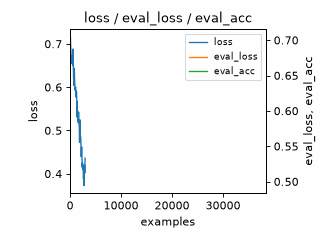

# liveplot

Live training curves in Jupyter, Colab and the VS Code / Cursor interactive window, with a tqdm bar underneath, at (almost) no cost to the training loop.



The GIF is cell 2 of [`examples/demo.py`](examples/demo.py), a tour of the features in a cell-separated file: open it in the VS Code / Cursor interactive window and run it cell by cell. That cell trains a tiny numpy classifier, logging the training loss every step and the eval loss and accuracy every 50 steps, laid out as `"loss | eval_loss eval_acc"`. The GIF itself was recorded by the library: `examples/make_gif.py` runs the same loop as a plain script with `record="docs/demo.gif"`.

```python
from liveplot import LivePlot

plot = LivePlot(range(num_steps))          # a tqdm bar + a live plot
for step in plot:
    loss, acc = train_step()
    plot.log(loss=loss, acc=acc)           # step is implicit; the bar's postfix shows the latest values
```

Metrics are discovered from what you log. With no layout given they all share one panel, with a legend. To split them up, give panel strings:

```python
plot = LivePlot(range(num_steps), "loss", "return | entropy", "lossD lossG | acc")
```

Each string is one panel. Names separated by spaces share the left y-axis; names after a `|` go on a right-hand y-axis. Anything you log that no string mentions gets a panel of its own. Every panel has a legend.

For nested loops, create the plot once and wrap the inner loop with `plot(...)`; the count, and so the x-axis, continues across epochs and you get one tqdm bar per epoch, as with tqdm:

```python
plot = LivePlot("loss", "acc", total=epochs * len(loader))
for epoch in range(epochs):
    for imgs, labels in plot(loader, desc=f"epoch {epoch}"):   # kwargs go to tqdm
        plot.log(loss=train_step(imgs, labels))
    plot.log(acc=evaluate())                                    # metrics can have different cadences
plot.finish()                                                   # or wrap the whole thing in `with LivePlot(...) as plot:`
```

If you'd rather supply the x values yourself, use the context manager and pass the step to `log`:

```python
with LivePlot("loss", "acc", total=num_steps) as plot:
    for step in range(num_steps):
        plot.log(step, loss=train_step())
```

Already have a tqdm bar? Pass it as the iterable and it is reused instead of wrapped: `LivePlot(tqdm(loader), "loss")`.

## Metrics logged at different rates

Nothing special is needed. Every metric keeps its own list of `(x, value)` points, and each `log` call stamps its metrics with the current x. A metric logged every step gets a point per step; one logged every 50 steps, or once per epoch after the inner loop, gets a point wherever the count was at the time and is drawn as a line through those points. So in `"loss | eval_loss eval_acc"` the left axis fills in continuously while the right axis grows a point every 50 steps, all against the same x.

## The x-axis

It follows tqdm: the plot counts items consumed and never looks at their values.

    x = initial + n * unit_scale

`n` is 0 inside the loop body for the first item, like `for step in range(N)`. `initial` shifts the start (`initial=1` for 1-based, `initial=10` to plot `range(10, 20)` at its values). `unit` and `unit_scale` relabel and rescale it: `unit="examples", unit_scale=batch_size` plots against examples seen, and the tqdm bar shows the same numbers. `total`, in items like tqdm's, fixes the x range; the single-loop form takes it from `len(iterable)`. An explicit `plot.log(step, ...)` uses that x for that call only, like wandb's `step=`.

## Install

```
pip install git+https://github.com/ARENA-education/liveplot.git
```

Only `matplotlib` is required. `ipython` is needed for the live display and `tqdm` for the bar; any notebook has both, and without them the plot silently just collects `plot.data`.

## How it works

The training thread only appends numbers (about 40 µs per `log`). A separate render process owns the matplotlib figure, redraws it at most once per `refresh_seconds` (default 1), and sends back PNG bytes that get swapped into a fixed output cell. The output is a plain image, so it behaves identically in Jupyter, Colab, VS Code and Cursor: no widgets, no JavaScript, no CDN.

Interrupting the cell is safe. Jupyter sends its interrupt to every process the kernel started; the render process ignores it, so you get a frozen plot with `plot.data` intact. A plot that is dropped without `finish()` shuts its process down when garbage collected, and the process exits by itself if the notebook kernel dies.

## Options

| | |
|---|---|
| `total`, `initial`, `unit`, `unit_scale` | tqdm's arguments, with tqdm's meaning; they define the x-axis (see above) |
| `refresh_seconds` | redraw interval (default 1.0) |
| `max_cols`, `rows`, `cols` | grid shape; `max_cols=None` gives a near-square grid |
| `progress`, `desc` | disable the bundled tqdm bars, or give the single-loop form's bar a description |
| `cell_size`, `dpi` | size of each panel in inches, and PNG resolution |
| `record` | `True` keeps every rendered frame in `plot.frames`; a path such as `"run.gif"` also writes an animated GIF at `finish()`. `plot.save_gif(path, speedup=1.0)` does it on demand. Works outside a notebook too. |

For labels or fixed ranges, use a dict instead of a string for that panel:

```python
{"metrics": ["acc"], "ylim": (0, 1), "ylabel": "test accuracy", "xlabel": "epoch"}
```

Allowed keys: `title`, `metrics`, `secondary`, `xlabel`, `ylabel`, `ylabel2`, `xlim`, `ylim`, `ylim2`.

`plot.log` accepts keywords, an explicit step (`plot.log(step, loss=...)`), or a dict (`plot.log(step, {"loss": ...})`). Values can be anything `float()` accepts, including one-element tensors. `plot.data` holds the full history as `{metric: (steps, values)}` and `plot.latest` the most recent value of each.

## Credits

The per-panel label/limit options and the grid-shape rule are adapted from Tyler Lum's [live_plotter](https://github.com/tylerlum/live_plotter) (MIT); see `THIRD_PARTY_LICENSES.md`.
